# 工业蒸汽预测
- 背景介绍
  
  火力发电的基本原理是：燃料在燃烧时加热水生成蒸汽，蒸汽压力推动汽轮机旋转，然后汽轮机带动发电机旋转，产生电能。在这一系列的能量转化中，影响发电效率的核心是锅炉的燃烧效率，即燃料燃烧加热水产生高温高压蒸汽。锅炉的燃烧效率的影响因素很多，包括锅炉的可调参数，如燃烧给量，一二次风，引风，返料风，给水水量；以及锅炉的工况，比如锅炉床温、床压，炉膛温度、压力，过热器的温度等

- 相关描述
  
    经脱敏后的锅炉传感器采集的数据（采集频率是分钟级别），根据锅炉的工况，预测产生的蒸汽量。

- 数据说明
  
    数据分成训练数据（train.txt）和测试数据（test.txt），其中字段”V0”-“V37”，这38个字段是作为特征变量，”target”作为目标变量。选手利用训练数据训练出模型，预测测试数据的目标变量，排名结果依据预测结果的MSE（mean square error）。

- 结果评估
  
    预测结果以mean square error作为评判标准。

## 前言

什么是`MSE`?从名字上来看，`MSE`就是均方误差。它的计算公式很像方差的计算公式。我的理解是，因为像这类问题都是回归预测问题，从而又引出了一些新的问题？
- 为什么要划分训练集和测试集
- 既然是预测回归问题，那么为什么不使用最小二乘法去拟合所有的数据从而得到一条直线来预测呢

针对这两个问题，首先，划分训练集和测试集的一个很重要的目的就是去**评估所得到模型的正确性**。假设你知道所有的数据，并且这些数据永远也不会增加，那么我觉得为了简单起见，大可以把数据直接拟合，然后对于这些已有的数据，就可以很好的“预测”。但是，世界是处在变化之中的，信息无时无刻不在增加，对于那些**我们从来没有见过的数据**，我们又怎么知道拟合出来曲线的正确性呢？如果模型只能很好的预测已经有的数据的话，那么这个模型还算做预测模型吗？
所以一般来说，我们会把数据集分为两部分，一部分用来训练(假设是80%)，那么剩下来的数据(20%)就可以用来检验我们**训练的模型预测出来的数据与我们实际的数据之间的差距**。显然，如果预测出来的数据 $\hat{y_i}$ 越接近于真实值 $ y_i $，那么就说明我们的预测结果也就越好。为了描述这个好的程度，所以也就有了`MSE`这个约定。
`MSE`的计算公式还是很简单的，它的计算公式为：$$ \text{MSE} = \frac{1}{n} \sum_{i=1}^n (y_i - \hat{y}_i)^2 $$

是不是很像方差的计算公式，只不过`MSE`计算的是实际值于预测值之间的误差的平均值，同样的，为了避免有负数，两者的结果加上了平方。显然，`MSE`越小，代表模型的预测效果也就越好。

# 1 数据探索

## 1.1 下载数据


```python
import numpy as np
import pandas as pd
import matplotlib.pyplot as plt
import seaborn as sns

from scipy import stats

import warnings
warnings.filterwarnings("ignore")
 
%matplotlib inline
```

    d:\forPy\lib\site-packages\scipy\__init__.py:146: UserWarning: A NumPy version >=1.16.5 and <1.23.0 is required for this version of SciPy (detected version 1.26.0
      warnings.warn(f"A NumPy version >={np_minversion} and <{np_maxversion}"


```python

# 下载需要用到的数据集
# 注意，需要事先安装wget工具，如果没有请自行安装
# 为了重启后不重复下载，我这里注释掉下载的部分，如果事先没有数据集请先下载
# %wget http://tianchi-media.oss-cn-beijing.aliyuncs.com/DSW/Industrial_Steam_Forecast/zhengqi_test.txt
# %wget http://tianchi-media.oss-cn-beijing.aliyuncs.com/DSW/Industrial_Steam_Forecast/zhengqi_train.txt

```


```python
# 使用Pandas库`read_csv()`函数进行数据读取，分割符为‘\t’
train_data_file = "./zhengqi_train.txt"
test_data_file =  "./zhengqi_test.txt"

# pandas
train_data = pd.read_csv(train_data_file, sep='\t', encoding='utf-8') # 训练集
test_data = pd.read_csv(test_data_file, sep='\t', encoding='utf-8') # 测试集
```

## 1.2 数据类型的查看


```python
#查看特征变量信息
train_data.info()
```


```python
# 测试集的数据
test_data.info()
```


这些数据的输出结果有点令人困惑，实际上这也就是为什么矩阵运算是机器学习的基石的原因。对于这些有着很多特征的变量来说，每一个变量的特征都可以表示为 $$ [x_{11}, x_{12},\dots ,x_{1n}] $$
这样不就是矩阵的雏形吗？对于训练集数据来说，可以看到总共有 `V0 ~ v37` 38个特征，总共有2888个`entries`，那么我们就可以构建出来一个高维矩阵来表达我们的意图。接下来我们可以看一看数据其它的一些特征 

## 1.3 更多的数据特征


```python
# 查看数据的统计信息
train_data.describe()
```


可以看到，这些信息包括平均值(mean),标准差、最大值和最小值，对应的，我们也可以查看测试集的一些统计特征


```python
test_data.describe()
```


```python
# 查看前五条信息，和shell中的head有点像

train_data.head() 
```


```python
# 目的同上
test_data.head()
```

## 1.4 可视化


```python

fig = plt.figure(figsize=(4, 4))  # 指定绘图对象宽度和高度
sns.boxplot(train_data['V0'],orient="v", width=0.5)
```


    <AxesSubplot:xlabel='V0'>


​    
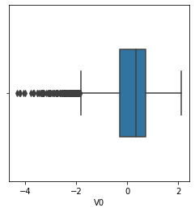
​    


这个图就叫做箱型图，从这个图上我们可以看到上边缘、上四分位数、中位数、下四分位数、下边缘、异常值，对应着图中的一条条黑色线段。可以看到，下边缘的左侧就是很多的异常值，对于这些异常值数据，最好的方法就是扔掉这些异常值数据。下边可以画出所有特征的箱式图


```python
# 画箱式图
column = train_data.columns.tolist()[:39]  # 列表头
fig = plt.figure(figsize=(20, 40))  # 指定绘图对象宽度和高度
for i in range(38):
    plt.subplot(13, 3, i + 1)  # 13行3列子图
    sns.boxplot(train_data[column[i]], orient="v", width=0.5)  # 箱式图
    plt.ylabel(column[i], fontsize=8)
plt.show()
```


​    
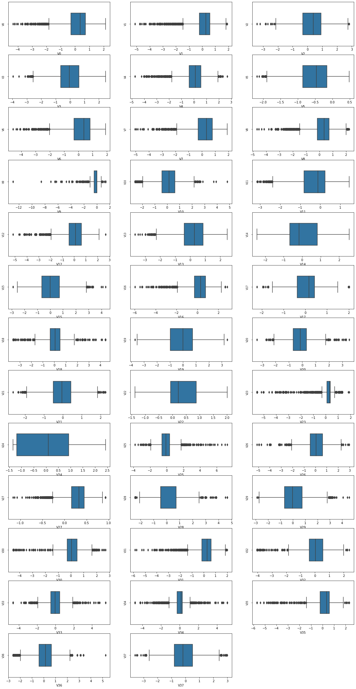
​    


## 1.5查看数据分布图

查看特征变量‘V0’的数据分布直方图，并绘制Q-Q图查看数据是否近似于正态分布
使用Seaborn库中的distplot函数绘制训练数据集中V0变量的分布图。distplot绘制的是核密度估计（Kernel Density Estimation）曲线和直方图，fit参数指定拟合到的分布函数，这里使用了正态（normal）分布函数。train_data['V0'] 表示选择训练数据集中的V0变量进行绘制。
stats.probplot是用于绘制概率图的函数，train_data['V0']表示选择训练数据集中的V0变量进行绘制，plot=plt表示图形输出到当前选择的子图中。
绘制完成后，可以通过观察分布图和概率图，判断V0变量的数据是否符合正态分布。分布图可以显示数据的整体分布情况，概率图可以显示数据和正态分布分位数之间的差异，从而判断数据是否具有正态分布的特征

在我看来，检查某个特征数据之间是否符合正态分布是十分关键的一项任务。对于统计机器学习来说，像本案例用到的线性回归算法都是基于正态分布的假设的，要是某个特征的分布不是正态分布的话，我觉得可以去除掉某些特征避免过拟合。


```python
plt.figure(figsize=(10,5))

ax=plt.subplot(1,2,1)
sns.distplot(train_data['V0'],fit=stats.norm)
ax=plt.subplot(1,2,2)
res = stats.probplot(train_data['V0'], plot=plt)

```


​    
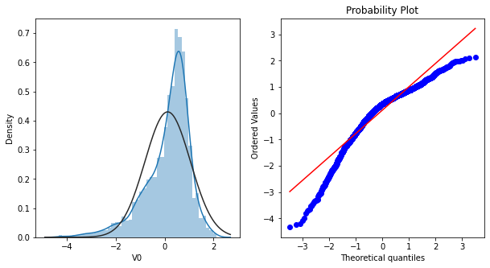
​    


可以查看一下所有特征的分布情况


```python
train_cols = 6
train_rows = len(train_data.columns)
plt.figure(figsize=(4*train_cols,4*train_rows))

i=0
for col in train_data.columns:
     i+=1
     ax=plt.subplot(train_rows,train_cols,i)
     sns.distplot(train_data[col],fit=stats.norm)
    
     i+=1
     ax=plt.subplot(train_rows,train_cols,i)
     res = stats.probplot(train_data[col], plot=plt)
plt.show()
```


​    
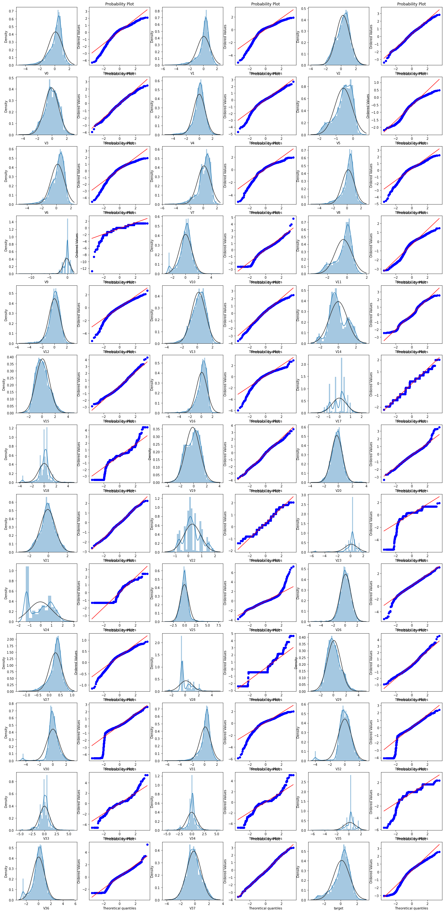
​    


从图上看，有很多的数据不符合要求，例如`V9、V17、V18、V23、V24、V35`都不符合要求，数据不符合正态分布，就可以考虑数据转换（如对数变换、平方根变换等。


```python
ax = sns.kdeplot(train_data['V0'], color="Red", shade=True)
ax = sns.kdeplot(test_data['V0'], color="Blue", shade=True)
ax.set_xlabel('V0')
ax.set_ylabel("Frequency")
ax = ax.legend(["train","test"])

# 这段代码的作用是绘制V0变量在训练集和测试集中的核密度估计图（KDE图），并且将两者的KDE图进行比较
```


​    
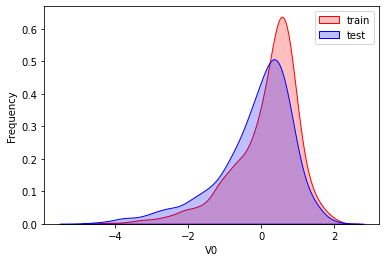
​    


可以找一找相差比较大的特征


```python
dist_cols = 6
dist_rows = len(test_data.columns)
plt.figure(figsize=(4*dist_cols,4*dist_rows))

i=1
for col in test_data.columns:
    ax=plt.subplot(dist_rows,dist_cols,i)
    ax = sns.kdeplot(train_data[col], color="Red", shade=True)
    ax = sns.kdeplot(test_data[col], color="Blue", shade=True)
    ax.set_xlabel(col)
    ax.set_ylabel("Frequency")
    ax = ax.legend(["train","test"])
    
    i+=1
plt.show()
```


​    
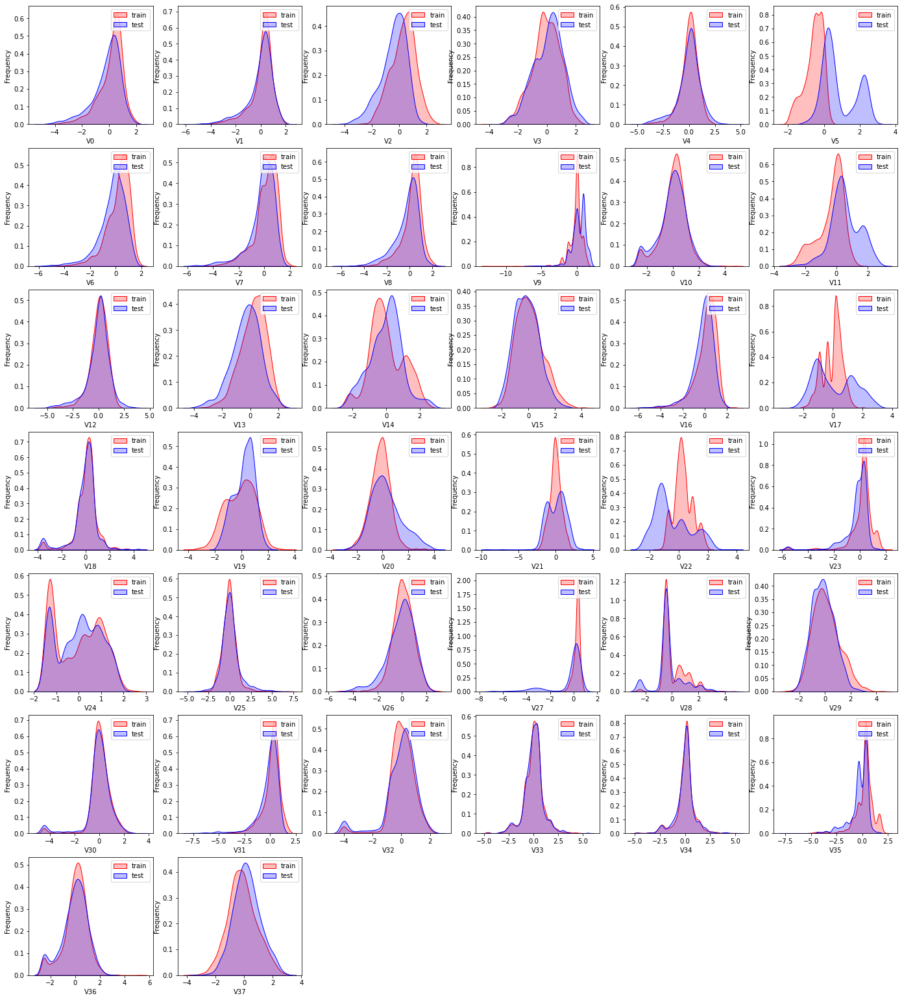
​    


可以看到，`V5、V11、V17、V19、V20、V21、V22` 相差较多，也就是说训练集和测试集对应的特征分布相差较多，在训练过程中，**模型可能会过多的学习测试集中未曾出现的数据**，而模型又未曾“见过”这些数据，所以可能会导致过拟合的问题，从而使得模型得泛化能力较差。

因此，可以直接扔掉一些特征


```python

drop_columns = ['V5','V9','V11','V17','V22','V28']
# 合并训练集和测试集数据，并可视化训练集和测试集数据特征分布图
```

## 1.6 可视化线性回归


```python
fcols = 2
frows = 1

plt.figure(figsize=(8,4))

ax=plt.subplot(1,2,1)
sns.regplot(x='V0', y='target', data=train_data, ax=ax, 
            scatter_kws={'marker':'.','s':3,'alpha':0.3},
            line_kws={'color':'k'});
plt.xlabel('V0')
plt.ylabel('target')

ax=plt.subplot(1,2,2)
sns.distplot(train_data['V0'].dropna())
plt.xlabel('V0')

plt.show()
```


​    
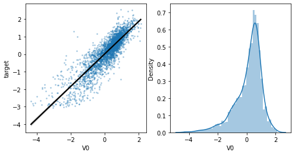
​    


# 2 准备阶段

## 2.1 查看变量之间的线性关系


```python
fcols = 6
frows = len(test_data.columns)
plt.figure(figsize=(5*fcols,4*frows))

i=0
for col in test_data.columns:
    i+=1
    ax=plt.subplot(frows,fcols,i)
    sns.regplot(x=col, y='target', data=train_data, ax=ax, 
                scatter_kws={'marker':'.','s':3,'alpha':0.3},
                line_kws={'color':'k'});
    plt.xlabel(col)
    plt.ylabel('target')
    
    i+=1
    ax=plt.subplot(frows,fcols,i)
    sns.distplot(train_data[col].dropna())
    plt.xlabel(col)
```


​    
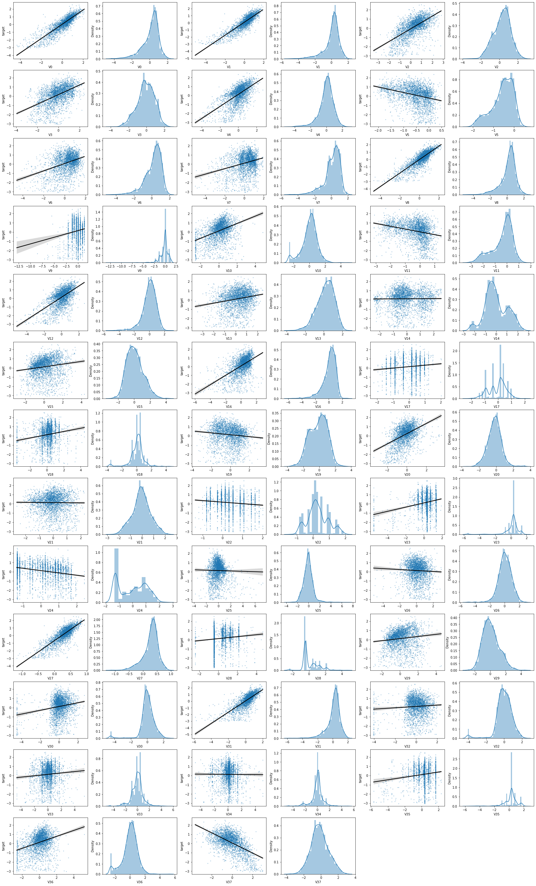
​    


实际上斜率越接近于0，整个特征之间的线性关系也就越差。

## 2.2 相关性分析


```python
# 扔掉了一些训练集与测试集特征不符合的特征
data_train1 = train_data.drop(['V5','V9','V11','V17','V22','V28'],axis=1) 
train_corr = data_train1.corr()
train_corr
```


通过相关性热力图可以更加清楚的看到各个特征之间的相关性


```python
# 画出相关性热力图
ax = plt.subplots(figsize=(20, 16))#调整画布大小

ax = sns.heatmap(train_corr, vmax=.8, square=True, annot=True)#画热力图   annot=True 显示系数
```


​    
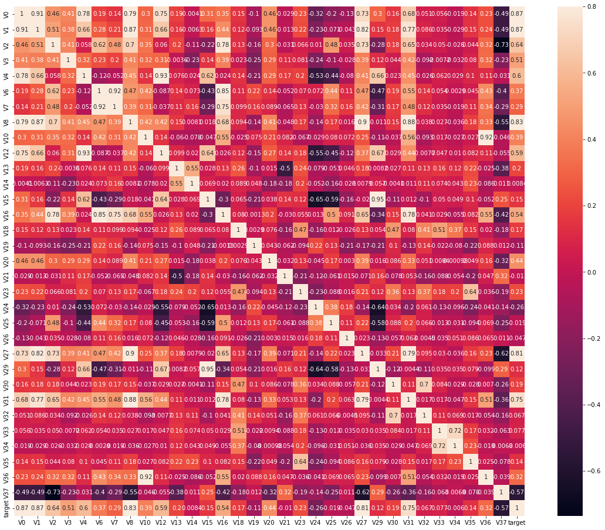
​    


有意思的一点是，这其实也是一个矩阵运算，也算是满足某种复合关系，可以看到矩阵的对角线元素全部为1，并且这个矩阵还是一个对称矩阵。因此只要画出上三角矩阵或者下三角矩阵即可


```python
# 找出相关程度
data_train1 = train_data.drop(['V5','V9','V11','V17','V22','V28'],axis=1)

plt.figure(figsize=(20, 16))  # 指定绘图对象宽度和高度
colnm = data_train1.columns.tolist()  # 列表头
mcorr = data_train1[colnm].corr(method="spearman")  # 相关系数矩阵，即给出了任意两个变量之间的相关系数
mask = np.zeros_like(mcorr, dtype=bool)  # 构造与mcorr同维数矩阵 为bool型
mask[np.triu_indices_from(mask)] = True  # 角分线右侧为True
cmap = sns.diverging_palette(220, 10, as_cmap=True)  # 返回matplotlib colormap对象
g = sns.heatmap(mcorr, mask=mask, cmap=cmap, square=True, annot=True, fmt='0.2f')  # 热力图（看两两相似度）
plt.show()
```


​    
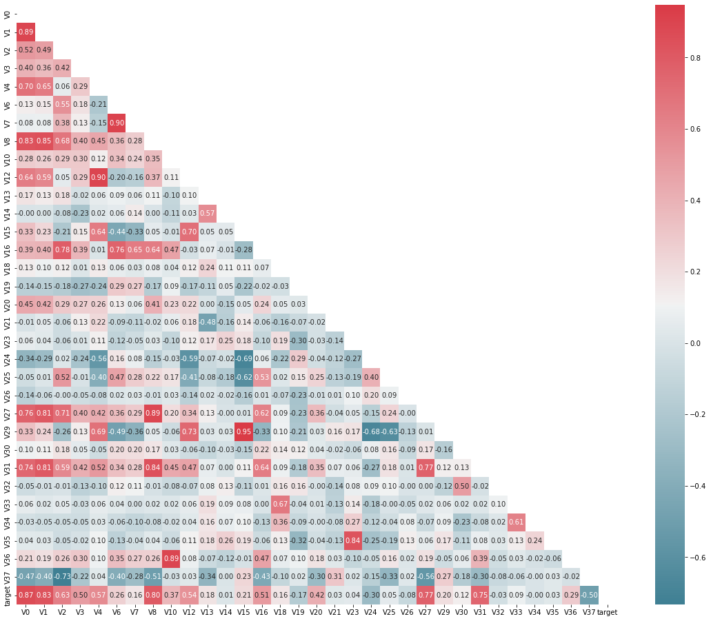
​    


通过热力图，可以清晰的看出各个特征与`target`变量之间的相关度。

## 2.3 寻找重要变量


```python
#寻找K个最相关的特征信息
k = 10 # number of variables for heatmap
cols = train_corr.nlargest(k, 'target')['target'].index  #获取与目标变量（target）之间相关性最高的前 k 个变量及其列名

cm = np.corrcoef(train_data[cols].values.T)
hm = plt.subplots(figsize=(10, 10))#调整画布大小
#hm = sns.heatmap(cm, cbar=True, annot=True, square=True)
#g = sns.heatmap(train_data[cols].corr(),annot=True,square=True,cmap="RdYlGn")
hm = sns.heatmap(train_data[cols].corr(),annot=True,square=True)

plt.show()
```


​    
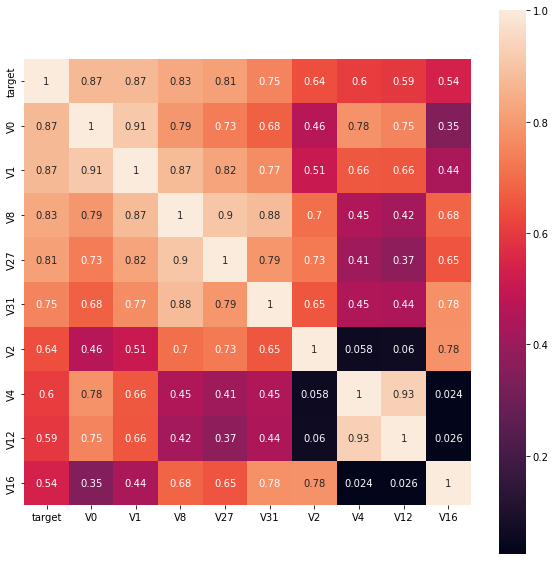
​    


```python
# 相关程度大于0.5的
threshold = 0.5

corrmat = train_data.corr()
top_corr_features = corrmat.index[abs(corrmat["target"])>threshold]
plt.figure(figsize=(10,10))
g = sns.heatmap(train_data[top_corr_features].corr(),annot=True,cmap="RdYlGn")
```


​    
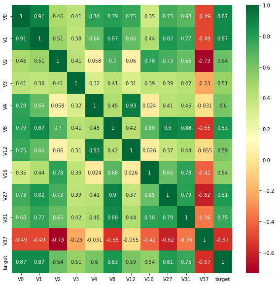
​    


```python
drop_columns.clear()
drop_columns = ['V5','V9','V11','V17','V22','V28']
```


```python
# Threshold for removing correlated variables
threshold = 0.5

# Absolute value correlation matrix
corr_matrix = data_train1.corr().abs()
drop_col=corr_matrix[corr_matrix["target"]<threshold].index
```

由于'V14', 'V21', 'V25', 'V26', 'V32', 'V33', 'V34'特征的相关系数值小于0.5，故认为这些特征与最终的预测target值不相关，删除这些特征变量；

把这些特征删除后再做训练


```python
#merge train_set and test_set
train_x =  train_data.drop(['target'], axis=1)

#data_all=pd.concat([train_data,test_data],axis=0,ignore_index=True)
data_all = pd.concat([train_x,test_data]) 


data_all.drop(drop_columns,axis=1,inplace=True)
#View data
data_all.head()
```


<div>
<style scoped>
    .dataframe tbody tr th:only-of-type {
        vertical-align: middle;
    }

    .dataframe tbody tr th {
        vertical-align: top;
    }
    
    .dataframe thead th {
        text-align: right;
    }
</style>
<table border="1" class="dataframe">
  <thead>
    <tr style="text-align: right;">
      <th></th>
      <th>V0</th>
      <th>V1</th>
      <th>V2</th>
      <th>V3</th>
      <th>V4</th>
      <th>V6</th>
      <th>V7</th>
      <th>V8</th>
      <th>V10</th>
      <th>V12</th>
      <th>...</th>
      <th>V27</th>
      <th>V29</th>
      <th>V30</th>
      <th>V31</th>
      <th>V32</th>
      <th>V33</th>
      <th>V34</th>
      <th>V35</th>
      <th>V36</th>
      <th>V37</th>
    </tr>
  </thead>
  <tbody>
    <tr>
      <th>0</th>
      <td>0.566</td>
      <td>0.016</td>
      <td>-0.143</td>
      <td>0.407</td>
      <td>0.452</td>
      <td>-1.812</td>
      <td>-2.360</td>
      <td>-0.436</td>
      <td>-0.940</td>
      <td>-0.073</td>
      <td>...</td>
      <td>0.168</td>
      <td>0.136</td>
      <td>0.109</td>
      <td>-0.615</td>
      <td>0.327</td>
      <td>-4.627</td>
      <td>-4.789</td>
      <td>-5.101</td>
      <td>-2.608</td>
      <td>-3.508</td>
    </tr>
    <tr>
      <th>1</th>
      <td>0.968</td>
      <td>0.437</td>
      <td>0.066</td>
      <td>0.566</td>
      <td>0.194</td>
      <td>-1.566</td>
      <td>-2.360</td>
      <td>0.332</td>
      <td>0.188</td>
      <td>-0.134</td>
      <td>...</td>
      <td>0.338</td>
      <td>-0.128</td>
      <td>0.124</td>
      <td>0.032</td>
      <td>0.600</td>
      <td>-0.843</td>
      <td>0.160</td>
      <td>0.364</td>
      <td>-0.335</td>
      <td>-0.730</td>
    </tr>
    <tr>
      <th>2</th>
      <td>1.013</td>
      <td>0.568</td>
      <td>0.235</td>
      <td>0.370</td>
      <td>0.112</td>
      <td>-1.367</td>
      <td>-2.360</td>
      <td>0.396</td>
      <td>0.874</td>
      <td>-0.072</td>
      <td>...</td>
      <td>0.326</td>
      <td>-0.009</td>
      <td>0.361</td>
      <td>0.277</td>
      <td>-0.116</td>
      <td>-0.843</td>
      <td>0.160</td>
      <td>0.364</td>
      <td>0.765</td>
      <td>-0.589</td>
    </tr>
    <tr>
      <th>3</th>
      <td>0.733</td>
      <td>0.368</td>
      <td>0.283</td>
      <td>0.165</td>
      <td>0.599</td>
      <td>-1.200</td>
      <td>-2.086</td>
      <td>0.403</td>
      <td>0.011</td>
      <td>-0.014</td>
      <td>...</td>
      <td>0.277</td>
      <td>0.015</td>
      <td>0.417</td>
      <td>0.279</td>
      <td>0.603</td>
      <td>-0.843</td>
      <td>-0.065</td>
      <td>0.364</td>
      <td>0.333</td>
      <td>-0.112</td>
    </tr>
    <tr>
      <th>4</th>
      <td>0.684</td>
      <td>0.638</td>
      <td>0.260</td>
      <td>0.209</td>
      <td>0.337</td>
      <td>-1.073</td>
      <td>-2.086</td>
      <td>0.314</td>
      <td>-0.251</td>
      <td>0.199</td>
      <td>...</td>
      <td>0.332</td>
      <td>0.183</td>
      <td>1.078</td>
      <td>0.328</td>
      <td>0.418</td>
      <td>-0.843</td>
      <td>-0.215</td>
      <td>0.364</td>
      <td>-0.280</td>
      <td>-0.028</td>
    </tr>
  </tbody>
</table>
<p>5 rows × 32 columns</p>
</div>


归一化


```python
# normalise numeric columns
cols_numeric=list(data_all.columns)

def scale_minmax(col):
    return (col-col.min())/(col.max()-col.min())

data_all[cols_numeric] = data_all[cols_numeric].apply(scale_minmax,axis=0)
data_all[cols_numeric].describe()
```


<div>
<style scoped>
    .dataframe tbody tr th:only-of-type {
        vertical-align: middle;
    }

    .dataframe tbody tr th {
        vertical-align: top;
    }
    
    .dataframe thead th {
        text-align: right;
    }
</style>
<table border="1" class="dataframe">
  <thead>
    <tr style="text-align: right;">
      <th></th>
      <th>V0</th>
      <th>V1</th>
      <th>V2</th>
      <th>V3</th>
      <th>V4</th>
      <th>V6</th>
      <th>V7</th>
      <th>V8</th>
      <th>V10</th>
      <th>V12</th>
      <th>...</th>
      <th>V27</th>
      <th>V29</th>
      <th>V30</th>
      <th>V31</th>
      <th>V32</th>
      <th>V33</th>
      <th>V34</th>
      <th>V35</th>
      <th>V36</th>
      <th>V37</th>
    </tr>
  </thead>
  <tbody>
    <tr>
      <th>count</th>
      <td>4813.000000</td>
      <td>4813.000000</td>
      <td>4813.000000</td>
      <td>4813.000000</td>
      <td>4813.000000</td>
      <td>4813.000000</td>
      <td>4813.000000</td>
      <td>4813.000000</td>
      <td>4813.000000</td>
      <td>4813.000000</td>
      <td>...</td>
      <td>4813.000000</td>
      <td>4813.000000</td>
      <td>4813.000000</td>
      <td>4813.000000</td>
      <td>4813.000000</td>
      <td>4813.000000</td>
      <td>4813.000000</td>
      <td>4813.000000</td>
      <td>4813.000000</td>
      <td>4813.000000</td>
    </tr>
    <tr>
      <th>mean</th>
      <td>0.694172</td>
      <td>0.721357</td>
      <td>0.602300</td>
      <td>0.603139</td>
      <td>0.523743</td>
      <td>0.748823</td>
      <td>0.745740</td>
      <td>0.715607</td>
      <td>0.348518</td>
      <td>0.578507</td>
      <td>...</td>
      <td>0.881401</td>
      <td>0.388683</td>
      <td>0.589459</td>
      <td>0.792709</td>
      <td>0.628824</td>
      <td>0.458493</td>
      <td>0.483790</td>
      <td>0.762873</td>
      <td>0.332385</td>
      <td>0.545795</td>
    </tr>
    <tr>
      <th>std</th>
      <td>0.144198</td>
      <td>0.131443</td>
      <td>0.140628</td>
      <td>0.152462</td>
      <td>0.106430</td>
      <td>0.132560</td>
      <td>0.132577</td>
      <td>0.118105</td>
      <td>0.134882</td>
      <td>0.105088</td>
      <td>...</td>
      <td>0.128221</td>
      <td>0.133475</td>
      <td>0.130786</td>
      <td>0.102976</td>
      <td>0.155003</td>
      <td>0.099095</td>
      <td>0.101020</td>
      <td>0.102037</td>
      <td>0.127456</td>
      <td>0.150356</td>
    </tr>
    <tr>
      <th>min</th>
      <td>0.000000</td>
      <td>0.000000</td>
      <td>0.000000</td>
      <td>0.000000</td>
      <td>0.000000</td>
      <td>0.000000</td>
      <td>0.000000</td>
      <td>0.000000</td>
      <td>0.000000</td>
      <td>0.000000</td>
      <td>...</td>
      <td>0.000000</td>
      <td>0.000000</td>
      <td>0.000000</td>
      <td>0.000000</td>
      <td>0.000000</td>
      <td>0.000000</td>
      <td>0.000000</td>
      <td>0.000000</td>
      <td>0.000000</td>
      <td>0.000000</td>
    </tr>
    <tr>
      <th>25%</th>
      <td>0.626676</td>
      <td>0.679416</td>
      <td>0.514414</td>
      <td>0.503888</td>
      <td>0.478182</td>
      <td>0.683324</td>
      <td>0.696938</td>
      <td>0.664934</td>
      <td>0.284327</td>
      <td>0.532892</td>
      <td>...</td>
      <td>0.888575</td>
      <td>0.292445</td>
      <td>0.550092</td>
      <td>0.761816</td>
      <td>0.562461</td>
      <td>0.409037</td>
      <td>0.454490</td>
      <td>0.727273</td>
      <td>0.270584</td>
      <td>0.445647</td>
    </tr>
    <tr>
      <th>50%</th>
      <td>0.729488</td>
      <td>0.752497</td>
      <td>0.617072</td>
      <td>0.614270</td>
      <td>0.535866</td>
      <td>0.774125</td>
      <td>0.771974</td>
      <td>0.742884</td>
      <td>0.366469</td>
      <td>0.591635</td>
      <td>...</td>
      <td>0.916015</td>
      <td>0.375734</td>
      <td>0.594428</td>
      <td>0.815055</td>
      <td>0.643056</td>
      <td>0.454518</td>
      <td>0.499949</td>
      <td>0.800020</td>
      <td>0.347056</td>
      <td>0.539317</td>
    </tr>
    <tr>
      <th>75%</th>
      <td>0.790195</td>
      <td>0.799553</td>
      <td>0.700464</td>
      <td>0.710474</td>
      <td>0.585036</td>
      <td>0.842259</td>
      <td>0.836405</td>
      <td>0.790835</td>
      <td>0.432965</td>
      <td>0.641971</td>
      <td>...</td>
      <td>0.932555</td>
      <td>0.471837</td>
      <td>0.650798</td>
      <td>0.852229</td>
      <td>0.719777</td>
      <td>0.500000</td>
      <td>0.511365</td>
      <td>0.800020</td>
      <td>0.414861</td>
      <td>0.643061</td>
    </tr>
    <tr>
      <th>max</th>
      <td>1.000000</td>
      <td>1.000000</td>
      <td>1.000000</td>
      <td>1.000000</td>
      <td>1.000000</td>
      <td>1.000000</td>
      <td>1.000000</td>
      <td>1.000000</td>
      <td>1.000000</td>
      <td>1.000000</td>
      <td>...</td>
      <td>1.000000</td>
      <td>1.000000</td>
      <td>1.000000</td>
      <td>1.000000</td>
      <td>1.000000</td>
      <td>1.000000</td>
      <td>1.000000</td>
      <td>1.000000</td>
      <td>1.000000</td>
      <td>1.000000</td>
    </tr>
  </tbody>
</table>
<p>8 rows × 32 columns</p>
</div>


```python
#col_data_process = cols_numeric.append('target')
train_data_process = train_data[cols_numeric]
train_data_process = train_data_process[cols_numeric].apply(scale_minmax,axis=0)

test_data_process = test_data[cols_numeric]
test_data_process = test_data_process[cols_numeric].apply(scale_minmax,axis=0)
```


```python
cols_numeric_left = cols_numeric[0:13]
cols_numeric_right = cols_numeric[13:]
```


```python
train_data_process = pd.concat([train_data_process, train_data['target']], axis=1)

fcols = 6
frows = len(cols_numeric_left)
plt.figure(figsize=(4*fcols,4*frows))
i=0

for var in cols_numeric_left:
    dat = train_data_process[[var, 'target']].dropna()
        
    i+=1
    plt.subplot(frows,fcols,i)
    sns.distplot(dat[var] , fit=stats.norm);
    plt.title(var+' Original')
    plt.xlabel('')
        
    i+=1
    plt.subplot(frows,fcols,i)
    _=stats.probplot(dat[var], plot=plt)
    plt.title('skew='+'{:.4f}'.format(stats.skew(dat[var])))
    plt.xlabel('')
    plt.ylabel('')
        
    i+=1
    plt.subplot(frows,fcols,i)
    plt.plot(dat[var], dat['target'],'.',alpha=0.5)
    plt.title('corr='+'{:.2f}'.format(np.corrcoef(dat[var], dat['target'])[0][1]))
 
    i+=1
    plt.subplot(frows,fcols,i)
    trans_var, lambda_var = stats.boxcox(dat[var].dropna()+1)
    trans_var = scale_minmax(trans_var)      
    sns.distplot(trans_var , fit=stats.norm);
    plt.title(var+' Tramsformed')
    plt.xlabel('')
        
    i+=1
    plt.subplot(frows,fcols,i)
    _=stats.probplot(trans_var, plot=plt)
    plt.title('skew='+'{:.4f}'.format(stats.skew(trans_var)))
    plt.xlabel('')
    plt.ylabel('')
        
    i+=1
    plt.subplot(frows,fcols,i)
    plt.plot(trans_var, dat['target'],'.',alpha=0.5)
    plt.title('corr='+'{:.2f}'.format(np.corrcoef(trans_var,dat['target'])[0][1]))
```


​    
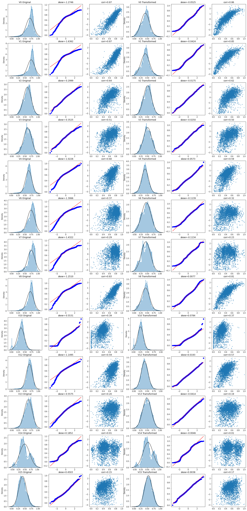
​    


```python
## Check effect of Box-Cox transforms on distributions of continuous variables

fcols = 6
frows = len(cols_numeric_right)
plt.figure(figsize=(4*fcols,4*frows))
i=0

for var in cols_numeric_right:
    dat = train_data_process[[var, 'target']].dropna()
        
    i+=1
    plt.subplot(frows,fcols,i)
    sns.distplot(dat[var] , fit=stats.norm);
    plt.title(var+' Original')
    plt.xlabel('')
        
    i+=1
    plt.subplot(frows,fcols,i)
    _=stats.probplot(dat[var], plot=plt)
    plt.title('skew='+'{:.4f}'.format(stats.skew(dat[var])))
    plt.xlabel('')
    plt.ylabel('')
        
    i+=1
    plt.subplot(frows,fcols,i)
    plt.plot(dat[var], dat['target'],'.',alpha=0.5)
    plt.title('corr='+'{:.2f}'.format(np.corrcoef(dat[var], dat['target'])[0][1]))
 
    i+=1
    plt.subplot(frows,fcols,i)
    trans_var, lambda_var = stats.boxcox(dat[var].dropna()+1)
    trans_var = scale_minmax(trans_var)      
    sns.distplot(trans_var , fit=stats.norm);
    plt.title(var+' Tramsformed')
    plt.xlabel('')
        
    i+=1
    plt.subplot(frows,fcols,i)
    _=stats.probplot(trans_var, plot=plt)
    plt.title('skew='+'{:.4f}'.format(stats.skew(trans_var)))
    plt.xlabel('')
    plt.ylabel('')
        
    i+=1
    plt.subplot(frows,fcols,i)
    plt.plot(trans_var, dat['target'],'.',alpha=0.5)
    plt.title('corr='+'{:.2f}'.format(np.corrcoef(trans_var,dat['target'])[0][1]))
```


​    
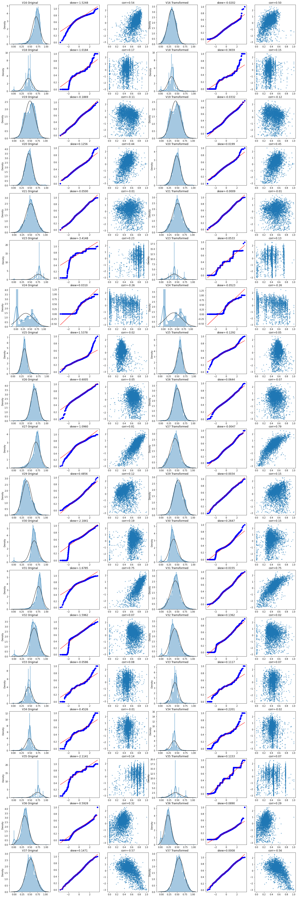
​    


# 3 训练阶段

## 3.1 数据的预处理


```python
# 导入数据分析工具包
import numpy as np
import pandas as pd
import matplotlib.pyplot as plt
import seaborn as sns

from scipy import stats

import warnings
warnings.filterwarnings("ignore")
 
%matplotlib inline

# 读取数据
train_data_file = "./zhengqi_train.txt"
test_data_file =  "./zhengqi_test.txt"

train_data = pd.read_csv(train_data_file, sep='\t', encoding='utf-8')
test_data = pd.read_csv(test_data_file, sep='\t', encoding='utf-8')
```

## 3.2 异常值处理

这是分析各个特征的异常值，计算方法有很多种，对于这些异常值来说，直接可以扔掉


```python
#异常值分析
plt.figure(figsize=(18, 10))
plt.boxplot(x=train_data.values,labels=train_data.columns)
plt.hlines([-7.5, 7.5], 0, 40, colors='r')
plt.show()
```


​    
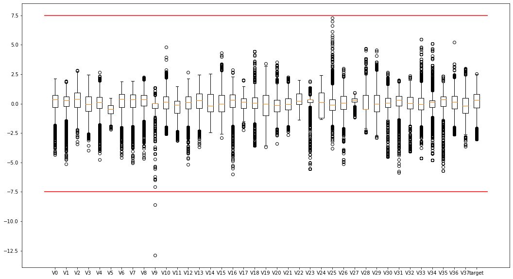
​    


```python

# 删除异常值
train_data = train_data[train_data['V9']>-7.5]
train_data.describe()
```


<div>
<style scoped>
    .dataframe tbody tr th:only-of-type {
        vertical-align: middle;
    }

    .dataframe tbody tr th {
        vertical-align: top;
    }
    
    .dataframe thead th {
        text-align: right;
    }
</style>
<table border="1" class="dataframe">
  <thead>
    <tr style="text-align: right;">
      <th></th>
      <th>V0</th>
      <th>V1</th>
      <th>V2</th>
      <th>V3</th>
      <th>V4</th>
      <th>V5</th>
      <th>V6</th>
      <th>V7</th>
      <th>V8</th>
      <th>V9</th>
      <th>...</th>
      <th>V29</th>
      <th>V30</th>
      <th>V31</th>
      <th>V32</th>
      <th>V33</th>
      <th>V34</th>
      <th>V35</th>
      <th>V36</th>
      <th>V37</th>
      <th>target</th>
    </tr>
  </thead>
  <tbody>
    <tr>
      <th>count</th>
      <td>2886.000000</td>
      <td>2886.000000</td>
      <td>2886.000000</td>
      <td>2886.000000</td>
      <td>2886.000000</td>
      <td>2886.000000</td>
      <td>2886.000000</td>
      <td>2886.000000</td>
      <td>2886.000000</td>
      <td>2886.00000</td>
      <td>...</td>
      <td>2886.000000</td>
      <td>2886.000000</td>
      <td>2886.000000</td>
      <td>2886.000000</td>
      <td>2886.000000</td>
      <td>2886.000000</td>
      <td>2886.000000</td>
      <td>2886.000000</td>
      <td>2886.000000</td>
      <td>2886.000000</td>
    </tr>
    <tr>
      <th>mean</th>
      <td>0.123725</td>
      <td>0.056856</td>
      <td>0.290340</td>
      <td>-0.068364</td>
      <td>0.012254</td>
      <td>-0.558971</td>
      <td>0.183273</td>
      <td>0.116274</td>
      <td>0.178138</td>
      <td>-0.16213</td>
      <td>...</td>
      <td>0.097019</td>
      <td>0.058619</td>
      <td>0.127617</td>
      <td>0.023626</td>
      <td>0.008271</td>
      <td>0.006959</td>
      <td>0.198513</td>
      <td>0.030099</td>
      <td>-0.131957</td>
      <td>0.127451</td>
    </tr>
    <tr>
      <th>std</th>
      <td>0.927984</td>
      <td>0.941269</td>
      <td>0.911231</td>
      <td>0.970357</td>
      <td>0.888037</td>
      <td>0.517871</td>
      <td>0.918211</td>
      <td>0.955418</td>
      <td>0.895552</td>
      <td>0.91089</td>
      <td>...</td>
      <td>1.060824</td>
      <td>0.894311</td>
      <td>0.873300</td>
      <td>0.896509</td>
      <td>1.007175</td>
      <td>1.003411</td>
      <td>0.985058</td>
      <td>0.970258</td>
      <td>1.015666</td>
      <td>0.983144</td>
    </tr>
    <tr>
      <th>min</th>
      <td>-4.335000</td>
      <td>-5.122000</td>
      <td>-3.420000</td>
      <td>-3.956000</td>
      <td>-4.742000</td>
      <td>-2.182000</td>
      <td>-4.576000</td>
      <td>-5.048000</td>
      <td>-4.692000</td>
      <td>-7.07100</td>
      <td>...</td>
      <td>-2.912000</td>
      <td>-4.507000</td>
      <td>-5.859000</td>
      <td>-4.053000</td>
      <td>-4.627000</td>
      <td>-4.789000</td>
      <td>-5.695000</td>
      <td>-2.608000</td>
      <td>-3.630000</td>
      <td>-3.044000</td>
    </tr>
    <tr>
      <th>25%</th>
      <td>-0.292000</td>
      <td>-0.224250</td>
      <td>-0.310000</td>
      <td>-0.652750</td>
      <td>-0.385000</td>
      <td>-0.853000</td>
      <td>-0.310000</td>
      <td>-0.295000</td>
      <td>-0.158750</td>
      <td>-0.39000</td>
      <td>...</td>
      <td>-0.664000</td>
      <td>-0.282000</td>
      <td>-0.170750</td>
      <td>-0.405000</td>
      <td>-0.499000</td>
      <td>-0.290000</td>
      <td>-0.199750</td>
      <td>-0.412750</td>
      <td>-0.798750</td>
      <td>-0.347500</td>
    </tr>
    <tr>
      <th>50%</th>
      <td>0.359500</td>
      <td>0.273000</td>
      <td>0.386000</td>
      <td>-0.045000</td>
      <td>0.109500</td>
      <td>-0.466000</td>
      <td>0.388500</td>
      <td>0.345000</td>
      <td>0.362000</td>
      <td>0.04200</td>
      <td>...</td>
      <td>-0.023000</td>
      <td>0.054500</td>
      <td>0.299500</td>
      <td>0.040000</td>
      <td>-0.040000</td>
      <td>0.160000</td>
      <td>0.364000</td>
      <td>0.137000</td>
      <td>-0.186000</td>
      <td>0.314000</td>
    </tr>
    <tr>
      <th>75%</th>
      <td>0.726000</td>
      <td>0.599000</td>
      <td>0.918750</td>
      <td>0.623500</td>
      <td>0.550000</td>
      <td>-0.154000</td>
      <td>0.831750</td>
      <td>0.782750</td>
      <td>0.726000</td>
      <td>0.04200</td>
      <td>...</td>
      <td>0.745000</td>
      <td>0.488000</td>
      <td>0.635000</td>
      <td>0.557000</td>
      <td>0.462000</td>
      <td>0.273000</td>
      <td>0.602000</td>
      <td>0.643750</td>
      <td>0.493000</td>
      <td>0.793750</td>
    </tr>
    <tr>
      <th>max</th>
      <td>2.121000</td>
      <td>1.918000</td>
      <td>2.828000</td>
      <td>2.457000</td>
      <td>2.689000</td>
      <td>0.489000</td>
      <td>1.895000</td>
      <td>1.918000</td>
      <td>2.245000</td>
      <td>1.33500</td>
      <td>...</td>
      <td>4.580000</td>
      <td>2.689000</td>
      <td>2.013000</td>
      <td>2.395000</td>
      <td>5.465000</td>
      <td>5.110000</td>
      <td>2.324000</td>
      <td>5.238000</td>
      <td>3.000000</td>
      <td>2.538000</td>
    </tr>
  </tbody>
</table>
<p>8 rows × 39 columns</p>
</div>


## 3.3 归一化


```python
from sklearn import preprocessing 

features_columns = [col for col in train_data.columns if col not in ['target']]

min_max_scaler = preprocessing.MinMaxScaler()

min_max_scaler = min_max_scaler.fit(train_data[features_columns])

train_data_scaler = min_max_scaler.transform(train_data[features_columns])
test_data_scaler = min_max_scaler.transform(test_data[features_columns])

train_data_scaler = pd.DataFrame(train_data_scaler)
train_data_scaler.columns = features_columns

test_data_scaler = pd.DataFrame(test_data_scaler)
test_data_scaler.columns = features_columns

train_data_scaler['target'] = train_data['target']
```

## 3.4 特征降维


```python
mcorr=mcorr.abs()
numerical_corr=mcorr[mcorr['target']>0.1]['target']
print(numerical_corr.sort_values(ascending=False))

index0 = numerical_corr.sort_values(ascending=False).index
print(train_data_scaler[index0].corr('spearman'))
```


## 3.4 相关性筛选


```python
features_corr = numerical_corr.sort_values(ascending=False).reset_index()
features_corr.columns = ['features_and_target', 'corr']
features_corr_select = features_corr[features_corr['corr']>0.3] # 筛选出大于相关性大于0.3的特征
print(features_corr_select)
select_features = [col for col in features_corr_select['features_and_target'] if col not in ['target']]
new_train_data_corr_select = train_data_scaler[select_features+['target']]
new_test_data_corr_select = test_data_scaler[select_features]
```

       features_and_target      corr
    0               target  1.000000
    1                   V0  0.866709
    2                   V1  0.832457
    3                   V8  0.799280
    4                  V27  0.765133
    5                  V31  0.749034
    6                   V2  0.630160
    7                   V4  0.574775
    8                  V12  0.542429
    9                  V16  0.510025
    10                  V3  0.501114
    11                 V37  0.497162
    12                 V20  0.420424
    13                 V10  0.371067


```python
%pip install statsmodels -i https://pypi.tuna.tsinghua.edu.cn/simple
```


## 3.5 主成分分析


```python
from sklearn.decomposition import PCA   #主成分分析法

#PCA方法降维
#保持90%的信息
pca = PCA(n_components=0.9)
new_train_pca_90 = pca.fit_transform(train_data_scaler.iloc[:,0:-1])
new_test_pca_90 = pca.transform(test_data_scaler)
new_train_pca_90 = pd.DataFrame(new_train_pca_90)
new_test_pca_90 = pd.DataFrame(new_test_pca_90)
new_train_pca_90['target'] = train_data_scaler['target']
new_train_pca_90.describe()
```


<div>
<style scoped>
    .dataframe tbody tr th:only-of-type {
        vertical-align: middle;
    }

    .dataframe tbody tr th {
        vertical-align: top;
    }
    
    .dataframe thead th {
        text-align: right;
    }
</style>
<table border="1" class="dataframe">
  <thead>
    <tr style="text-align: right;">
      <th></th>
      <th>0</th>
      <th>1</th>
      <th>2</th>
      <th>3</th>
      <th>4</th>
      <th>5</th>
      <th>6</th>
      <th>7</th>
      <th>8</th>
      <th>9</th>
      <th>10</th>
      <th>11</th>
      <th>12</th>
      <th>13</th>
      <th>14</th>
      <th>15</th>
      <th>target</th>
    </tr>
  </thead>
  <tbody>
    <tr>
      <th>count</th>
      <td>2.886000e+03</td>
      <td>2.886000e+03</td>
      <td>2.886000e+03</td>
      <td>2.886000e+03</td>
      <td>2.886000e+03</td>
      <td>2.886000e+03</td>
      <td>2.886000e+03</td>
      <td>2.886000e+03</td>
      <td>2.886000e+03</td>
      <td>2.886000e+03</td>
      <td>2.886000e+03</td>
      <td>2.886000e+03</td>
      <td>2.886000e+03</td>
      <td>2.886000e+03</td>
      <td>2.886000e+03</td>
      <td>2.886000e+03</td>
      <td>2884.000000</td>
    </tr>
    <tr>
      <th>mean</th>
      <td>-2.901665e-17</td>
      <td>-1.503860e-16</td>
      <td>4.844242e-17</td>
      <td>-1.050403e-16</td>
      <td>1.109646e-16</td>
      <td>-4.866362e-17</td>
      <td>3.614668e-17</td>
      <td>2.703909e-17</td>
      <td>-3.216031e-17</td>
      <td>9.657709e-17</td>
      <td>1.605491e-17</td>
      <td>1.142297e-16</td>
      <td>2.832300e-18</td>
      <td>-5.808378e-17</td>
      <td>-1.311261e-17</td>
      <td>1.321774e-16</td>
      <td>0.127274</td>
    </tr>
    <tr>
      <th>std</th>
      <td>3.998976e-01</td>
      <td>3.500240e-01</td>
      <td>2.938631e-01</td>
      <td>2.728023e-01</td>
      <td>2.077128e-01</td>
      <td>1.951842e-01</td>
      <td>1.877104e-01</td>
      <td>1.607670e-01</td>
      <td>1.512707e-01</td>
      <td>1.443772e-01</td>
      <td>1.368790e-01</td>
      <td>1.286192e-01</td>
      <td>1.193301e-01</td>
      <td>1.149758e-01</td>
      <td>1.133507e-01</td>
      <td>1.019259e-01</td>
      <td>0.983462</td>
    </tr>
    <tr>
      <th>min</th>
      <td>-1.071795e+00</td>
      <td>-9.429479e-01</td>
      <td>-9.948314e-01</td>
      <td>-7.103087e-01</td>
      <td>-7.703987e-01</td>
      <td>-5.340294e-01</td>
      <td>-5.993766e-01</td>
      <td>-5.870755e-01</td>
      <td>-6.282818e-01</td>
      <td>-4.902583e-01</td>
      <td>-6.341045e-01</td>
      <td>-5.906753e-01</td>
      <td>-4.175153e-01</td>
      <td>-4.310613e-01</td>
      <td>-4.170535e-01</td>
      <td>-3.601627e-01</td>
      <td>-3.044000</td>
    </tr>
    <tr>
      <th>25%</th>
      <td>-2.804085e-01</td>
      <td>-2.613727e-01</td>
      <td>-2.090797e-01</td>
      <td>-1.945196e-01</td>
      <td>-1.315620e-01</td>
      <td>-1.264097e-01</td>
      <td>-1.236360e-01</td>
      <td>-1.016452e-01</td>
      <td>-9.662098e-02</td>
      <td>-9.297088e-02</td>
      <td>-8.202809e-02</td>
      <td>-7.721868e-02</td>
      <td>-7.139961e-02</td>
      <td>-7.474073e-02</td>
      <td>-7.709743e-02</td>
      <td>-6.603914e-02</td>
      <td>-0.348500</td>
    </tr>
    <tr>
      <th>50%</th>
      <td>-1.417104e-02</td>
      <td>-1.277241e-02</td>
      <td>2.112166e-02</td>
      <td>-2.337401e-02</td>
      <td>-5.122797e-03</td>
      <td>-1.355336e-02</td>
      <td>-1.747870e-04</td>
      <td>-4.656359e-03</td>
      <td>2.572054e-03</td>
      <td>-1.479172e-03</td>
      <td>7.286444e-03</td>
      <td>-5.745946e-03</td>
      <td>-4.140670e-03</td>
      <td>1.054915e-03</td>
      <td>-1.758387e-03</td>
      <td>-7.533392e-04</td>
      <td>0.313000</td>
    </tr>
    <tr>
      <th>75%</th>
      <td>2.287306e-01</td>
      <td>2.317720e-01</td>
      <td>2.069571e-01</td>
      <td>1.657590e-01</td>
      <td>1.281660e-01</td>
      <td>9.993122e-02</td>
      <td>1.272081e-01</td>
      <td>9.657222e-02</td>
      <td>1.002626e-01</td>
      <td>9.059634e-02</td>
      <td>8.833765e-02</td>
      <td>7.148033e-02</td>
      <td>6.786199e-02</td>
      <td>7.574868e-02</td>
      <td>7.116829e-02</td>
      <td>6.357449e-02</td>
      <td>0.794250</td>
    </tr>
    <tr>
      <th>max</th>
      <td>1.597730e+00</td>
      <td>1.382802e+00</td>
      <td>1.010250e+00</td>
      <td>1.448007e+00</td>
      <td>1.034061e+00</td>
      <td>1.358962e+00</td>
      <td>6.191589e-01</td>
      <td>7.370089e-01</td>
      <td>6.449125e-01</td>
      <td>5.839586e-01</td>
      <td>6.405187e-01</td>
      <td>6.780732e-01</td>
      <td>5.156118e-01</td>
      <td>4.978126e-01</td>
      <td>4.673189e-01</td>
      <td>4.570870e-01</td>
      <td>2.538000</td>
    </tr>
  </tbody>
</table>
</div>


```python
#PCA方法降维
#保留16个主成分
pca = PCA(n_components=0.95)
new_train_pca_16 = pca.fit_transform(train_data_scaler.iloc[:,0:-1])
new_test_pca_16 = pca.transform(test_data_scaler)
new_train_pca_16 = pd.DataFrame(new_train_pca_16)
new_test_pca_16 = pd.DataFrame(new_test_pca_16)
new_train_pca_16['target'] = train_data_scaler['target']
new_train_pca_16.describe()
```


<div>
<style scoped>
    .dataframe tbody tr th:only-of-type {
        vertical-align: middle;
    }

    .dataframe tbody tr th {
        vertical-align: top;
    }
    
    .dataframe thead th {
        text-align: right;
    }
</style>
<table border="1" class="dataframe">
  <thead>
    <tr style="text-align: right;">
      <th></th>
      <th>0</th>
      <th>1</th>
      <th>2</th>
      <th>3</th>
      <th>4</th>
      <th>5</th>
      <th>6</th>
      <th>7</th>
      <th>8</th>
      <th>9</th>
      <th>...</th>
      <th>12</th>
      <th>13</th>
      <th>14</th>
      <th>15</th>
      <th>16</th>
      <th>17</th>
      <th>18</th>
      <th>19</th>
      <th>20</th>
      <th>target</th>
    </tr>
  </thead>
  <tbody>
    <tr>
      <th>count</th>
      <td>2.886000e+03</td>
      <td>2.886000e+03</td>
      <td>2.886000e+03</td>
      <td>2.886000e+03</td>
      <td>2.886000e+03</td>
      <td>2.886000e+03</td>
      <td>2.886000e+03</td>
      <td>2.886000e+03</td>
      <td>2.886000e+03</td>
      <td>2.886000e+03</td>
      <td>...</td>
      <td>2.886000e+03</td>
      <td>2.886000e+03</td>
      <td>2.886000e+03</td>
      <td>2.886000e+03</td>
      <td>2.886000e+03</td>
      <td>2.886000e+03</td>
      <td>2.886000e+03</td>
      <td>2.886000e+03</td>
      <td>2.886000e+03</td>
      <td>2884.000000</td>
    </tr>
    <tr>
      <th>mean</th>
      <td>-2.901665e-17</td>
      <td>-1.503860e-16</td>
      <td>4.844242e-17</td>
      <td>-1.050403e-16</td>
      <td>1.109646e-16</td>
      <td>-4.866362e-17</td>
      <td>3.614668e-17</td>
      <td>2.703909e-17</td>
      <td>-3.216031e-17</td>
      <td>9.657709e-17</td>
      <td>...</td>
      <td>2.832300e-18</td>
      <td>-5.808378e-17</td>
      <td>-1.311261e-17</td>
      <td>1.321774e-16</td>
      <td>3.109278e-17</td>
      <td>3.629575e-17</td>
      <td>5.614109e-18</td>
      <td>3.614668e-17</td>
      <td>-1.245617e-16</td>
      <td>0.127274</td>
    </tr>
    <tr>
      <th>std</th>
      <td>3.998976e-01</td>
      <td>3.500240e-01</td>
      <td>2.938631e-01</td>
      <td>2.728023e-01</td>
      <td>2.077128e-01</td>
      <td>1.951842e-01</td>
      <td>1.877104e-01</td>
      <td>1.607670e-01</td>
      <td>1.512707e-01</td>
      <td>1.443772e-01</td>
      <td>...</td>
      <td>1.193301e-01</td>
      <td>1.149758e-01</td>
      <td>1.133507e-01</td>
      <td>1.019259e-01</td>
      <td>9.617307e-02</td>
      <td>9.205940e-02</td>
      <td>8.423171e-02</td>
      <td>8.295263e-02</td>
      <td>7.696785e-02</td>
      <td>0.983462</td>
    </tr>
    <tr>
      <th>min</th>
      <td>-1.071795e+00</td>
      <td>-9.429479e-01</td>
      <td>-9.948314e-01</td>
      <td>-7.103087e-01</td>
      <td>-7.703987e-01</td>
      <td>-5.340294e-01</td>
      <td>-5.993766e-01</td>
      <td>-5.870755e-01</td>
      <td>-6.282818e-01</td>
      <td>-4.902583e-01</td>
      <td>...</td>
      <td>-4.175153e-01</td>
      <td>-4.310613e-01</td>
      <td>-4.170535e-01</td>
      <td>-3.601627e-01</td>
      <td>-3.432530e-01</td>
      <td>-3.530609e-01</td>
      <td>-3.908328e-01</td>
      <td>-3.089560e-01</td>
      <td>-2.867812e-01</td>
      <td>-3.044000</td>
    </tr>
    <tr>
      <th>25%</th>
      <td>-2.804085e-01</td>
      <td>-2.613727e-01</td>
      <td>-2.090797e-01</td>
      <td>-1.945196e-01</td>
      <td>-1.315620e-01</td>
      <td>-1.264097e-01</td>
      <td>-1.236360e-01</td>
      <td>-1.016452e-01</td>
      <td>-9.662098e-02</td>
      <td>-9.297088e-02</td>
      <td>...</td>
      <td>-7.139961e-02</td>
      <td>-7.474073e-02</td>
      <td>-7.709743e-02</td>
      <td>-6.603914e-02</td>
      <td>-6.064846e-02</td>
      <td>-6.247177e-02</td>
      <td>-5.357475e-02</td>
      <td>-5.279870e-02</td>
      <td>-4.930849e-02</td>
      <td>-0.348500</td>
    </tr>
    <tr>
      <th>50%</th>
      <td>-1.417104e-02</td>
      <td>-1.277241e-02</td>
      <td>2.112166e-02</td>
      <td>-2.337401e-02</td>
      <td>-5.122797e-03</td>
      <td>-1.355336e-02</td>
      <td>-1.747870e-04</td>
      <td>-4.656359e-03</td>
      <td>2.572054e-03</td>
      <td>-1.479172e-03</td>
      <td>...</td>
      <td>-4.140670e-03</td>
      <td>1.054915e-03</td>
      <td>-1.758387e-03</td>
      <td>-7.533392e-04</td>
      <td>-4.559279e-03</td>
      <td>-2.317781e-03</td>
      <td>-3.034317e-04</td>
      <td>3.391130e-03</td>
      <td>-1.703944e-03</td>
      <td>0.313000</td>
    </tr>
    <tr>
      <th>75%</th>
      <td>2.287306e-01</td>
      <td>2.317720e-01</td>
      <td>2.069571e-01</td>
      <td>1.657590e-01</td>
      <td>1.281660e-01</td>
      <td>9.993122e-02</td>
      <td>1.272081e-01</td>
      <td>9.657222e-02</td>
      <td>1.002626e-01</td>
      <td>9.059634e-02</td>
      <td>...</td>
      <td>6.786199e-02</td>
      <td>7.574868e-02</td>
      <td>7.116829e-02</td>
      <td>6.357449e-02</td>
      <td>5.732624e-02</td>
      <td>6.139602e-02</td>
      <td>5.068802e-02</td>
      <td>5.084688e-02</td>
      <td>4.693391e-02</td>
      <td>0.794250</td>
    </tr>
    <tr>
      <th>max</th>
      <td>1.597730e+00</td>
      <td>1.382802e+00</td>
      <td>1.010250e+00</td>
      <td>1.448007e+00</td>
      <td>1.034061e+00</td>
      <td>1.358962e+00</td>
      <td>6.191589e-01</td>
      <td>7.370089e-01</td>
      <td>6.449125e-01</td>
      <td>5.839586e-01</td>
      <td>...</td>
      <td>5.156118e-01</td>
      <td>4.978126e-01</td>
      <td>4.673189e-01</td>
      <td>4.570870e-01</td>
      <td>5.153325e-01</td>
      <td>3.556862e-01</td>
      <td>4.709891e-01</td>
      <td>3.677911e-01</td>
      <td>3.663361e-01</td>
      <td>2.538000</td>
    </tr>
  </tbody>
</table>
<p>8 rows × 22 columns</p>
</div>


# 4 模型训练

## 4.1 回归模型


```python
# 导入相关库
from sklearn.linear_model import LinearRegression  #线性回归
from sklearn.neighbors import KNeighborsRegressor  #K近邻回归
from sklearn.tree import DecisionTreeRegressor     #决策树回归
from sklearn.ensemble import RandomForestRegressor #随机森林回归
from sklearn.svm import SVR  #支持向量回归
import lightgbm as lgb #lightGbm模型
from sklearn.ensemble import GradientBoostingRegressor

from sklearn.model_selection import train_test_split # 切分数据
from sklearn.metrics import mean_squared_error #评价指标

from sklearn.model_selection import learning_curve
from sklearn.model_selection import ShuffleSplit

## 切分训练数据和线下验证数据

#采用 pca 保留16维特征的数据
new_train_pca_16 = new_train_pca_16.fillna(0) #将所有缺失值设置为0。这一步可以避免之后的特征处理和模型训练中出现空值导致的错误。
train = new_train_pca_16[new_test_pca_16.columns]
target = new_train_pca_16['target']

# 切分数据 训练数据80% 验证数据20%
train_data,test_data,train_target,test_target=train_test_split(train,target,test_size=0.2,random_state=0)
```

## 4.2 多元回归模型


```python
clf = LinearRegression()
clf.fit(train_data, train_target)
score = mean_squared_error(test_target, clf.predict(test_data))
print("LinearRegression:   ", score)

train_score = []
test_score = []

# 给予不同的数据量，查看模型的学习效果
for i in range(10, len(train_data)+1, 10):
    lin_reg = LinearRegression()
    lin_reg.fit(train_data[:i], train_target[:i])
    # LinearRegression().fit(X_train[:i], y_train[:i])
    
    # 查看模型的预测情况：两种，模型基于训练数据集预测的情况(可以理解为模型拟合训练数据集的情况)，模型基于测试数据集预测的情况
    # 此处使用 lin_reg.predict(X_train[:i])，为训练模型的全部数据集
    y_train_predict = lin_reg.predict(train_data[:i])
    train_score.append(mean_squared_error(train_target[:i], y_train_predict))
    
    y_test_predict = lin_reg.predict(test_data)
    test_score.append(mean_squared_error(test_target, y_test_predict))
    
# np.sqrt(train_score)：将列表 train_score 中的数开平方
plt.plot([i for i in range(1, len(train_score)+1)], train_score, label='train')
plt.plot([i for i in range(1, len(test_score)+1)], test_score, label='test')

# plt.legend()：显示图例（如图形的 label）；
plt.legend()
plt.show()
```

    LinearRegression:    0.2642337917628172


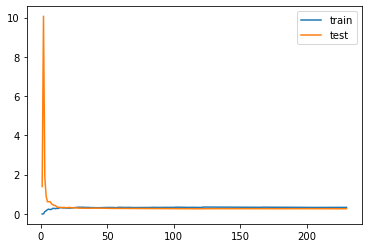
    


定义绘制模型学习曲线函数
代码解释：

`np.linspace()`: 用于生成等间隔的数列，返回一个一维数组。在这里，头两个参数分别为数组的起点和终点，即 .1 和 1.0，参数 5 表示数组的长度，即需要生成 5 个分割点，均分在 .1 和 1.0 之间，生成的大小分别为 0.1、0.34、0.58、0.82、1.0。

当输入的 `train_sizes` 参数是一维数组时，返回的训练集规模等于样本总数乘以` array `中对应的每个数；

当输入的 `train_sizes` 参数是一个表示具体数值的整数、或者是一个小于 1 的浮点数时，返回的是样本数量乘以这个数。


```python
def plot_learning_curve(estimator, title, X, y, ylim=None, cv=None,
                        n_jobs=1, train_sizes=np.linspace(.1, 1.0, 5)):
    plt.figure()
    plt.title(title)
    if ylim is not None:
        plt.ylim(*ylim)
    plt.xlabel("Training examples")
    plt.ylabel("Score")
    train_sizes, train_scores, test_scores = learning_curve(
        estimator, X, y, cv=cv, n_jobs=n_jobs, train_sizes=train_sizes) 
    train_scores_mean = np.mean(train_scores, axis=1)
    train_scores_std = np.std(train_scores, axis=1)
    test_scores_mean = np.mean(test_scores, axis=1)
    test_scores_std = np.std(test_scores, axis=1)
    
    print(train_scores_mean)
    print(test_scores_mean)
    
    plt.grid()
 
    plt.fill_between(train_sizes, train_scores_mean - train_scores_std,
                     train_scores_mean + train_scores_std, alpha=0.1,
                     color="r")
    plt.fill_between(train_sizes, test_scores_mean - test_scores_std,
                     test_scores_mean + test_scores_std, alpha=0.1, color="g")
    plt.plot(train_sizes, train_scores_mean, 'o-', color="r",
             label="Training score")
    plt.plot(train_sizes, test_scores_mean, 'o-', color="g",
             label="Cross-validation score")
 
    plt.legend(loc="best")
    return plt
```


```python
# 线性回归模型学习曲线
X = train_data.values
y = train_target.values
 
# 图一
title = r"LinearRegression"
cv = ShuffleSplit(n_splits=100, test_size=0.2, random_state=0)
estimator = LinearRegression()    #建模
plot_learning_curve(estimator, title, X, y, ylim=(0.5, 0.8), cv=cv, n_jobs=1)
```

    [0.70183463 0.66761103 0.66101945 0.65732898 0.65360375]
    [0.57364886 0.61882339 0.62809368 0.63012866 0.63158596]


​    
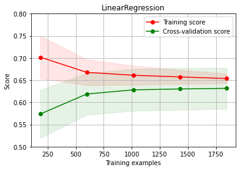
​    


## 4.3 KNN近邻回归

K近邻回归（K-Nearest Neighbors Regression，简称KNN回归）是一种基于实例的学习方法，主要用于解决回归问题，即预测连续数值型的目标变量。这种算法并不在训练阶段建立显式的模型，而是依赖于存储训练数据集中的实例。当需要对新实例进行预测时，KNN回归算法会根据新实例与训练集中各个实例的距离来寻找最接近的K个邻居，然后基于这K个邻居的信息来进行预测。


```python
for i in range(3,10):
    clf = KNeighborsRegressor(n_neighbors=i) # 最近三个
    clf.fit(train_data, train_target)
    score = mean_squared_error(test_target, clf.predict(test_data))
    # 打印MSE
    print("KNeighborsRegressor:   ", score)
```

    KNeighborsRegressor:    0.27619208861976163
    KNeighborsRegressor:    0.2597627823313149
    KNeighborsRegressor:    0.2628212724567474
    KNeighborsRegressor:    0.26670982271241833
    KNeighborsRegressor:    0.26596039050914483
    KNeighborsRegressor:    0.2635369464478806
    KNeighborsRegressor:    0.2673470579477979


```python
# 绘制K近邻回归学习曲线
X = train_data.values
y = train_target.values
 
# K近邻回归
title = r"KNeighborsRegressor"
cv = ShuffleSplit(n_splits=100, test_size=0.2, random_state=0)

estimator = KNeighborsRegressor(n_neighbors=8)    #建模
plot_learning_curve(estimator, title, X, y, ylim=(0.3, 0.9), cv=cv, n_jobs=1)
```

    [0.61581146 0.68763995 0.71414969 0.73084172 0.73976273]
    [0.50369207 0.58753672 0.61969929 0.64062459 0.6560054 ]


​    
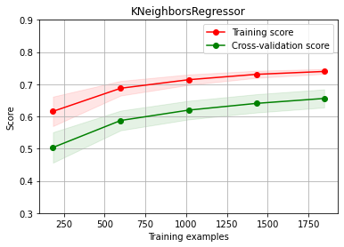
​    


## 4.4 决策树回归


```python
clf = DecisionTreeRegressor() 
clf.fit(train_data, train_target)
score = mean_squared_error(test_target, clf.predict(test_data))
print("DecisionTreeRegressor:   ", score)
```

    DecisionTreeRegressor:    0.580573437716263


```python
X = train_data.values
y = train_target.values
 
# 决策树回归
title = r"DecisionTreeRegressor"
cv = ShuffleSplit(n_splits=100, test_size=0.2, random_state=0)

estimator = DecisionTreeRegressor()    #建模
plot_learning_curve(estimator, title, X, y, ylim=(0.1, 1.3), cv=cv, n_jobs=1)
```

    [1. 1. 1. 1. 1.]
    [0.12540317 0.22481387 0.28546605 0.30907429 0.32813838]


​    
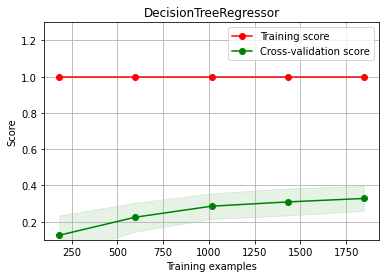
​    


## 4.5 随机森林回归


```python
clf = RandomForestRegressor(n_estimators=200) # 100棵树模型
clf.fit(train_data, train_target)
score = mean_squared_error(test_target, clf.predict(test_data))
# MSE
print("RandomForestRegressor:   ", score)
```

    RandomForestRegressor:    0.244919483291609


```python
X = train_data.values
y = train_target.values
 
# 随机森林
title = r"RandomForestRegressor"
cv = ShuffleSplit(n_splits=100, test_size=0.2, random_state=0)

estimator = RandomForestRegressor(n_estimators=200)    #建模
plot_learning_curve(estimator, title, X, y, ylim=(0.4, 1.0), cv=cv, n_jobs=1)
```

    [0.93570831 0.94794348 0.95186584 0.95422271 0.95565758]
    [0.53993522 0.61475498 0.64293685 0.6600363  0.67277925]


​    
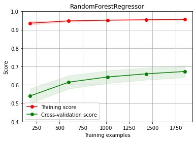
​    


## 4.6 Gradient Boosting


```python
from sklearn.ensemble import GradientBoostingRegressor

myGBR = GradientBoostingRegressor(alpha=0.9, criterion='friedman_mse', init=None,
                                  learning_rate=0.03, loss='huber', max_depth=14,
                                  max_features='sqrt', max_leaf_nodes=None,
                                  min_impurity_decrease=0.0, min_impurity_split=None,
                                  min_samples_leaf=10, min_samples_split=40,
                                  min_weight_fraction_leaf=0.0, n_estimators=10,
                                  warm_start=False)

myGBR.fit(train_data, train_target)
score = mean_squared_error(test_target, clf.predict(test_data))
# MSE
print("GradientBoostingRegressor:   ", score)


myGBR = GradientBoostingRegressor(alpha=0.9, criterion='friedman_mse', init=None,
                                  learning_rate=0.03, loss='huber', max_depth=14,
                                  max_features='sqrt', max_leaf_nodes=None,
                                  min_impurity_decrease=0.0, min_impurity_split=None,
                                  min_samples_leaf=10, min_samples_split=40,
                                  min_weight_fraction_leaf=0.0, n_estimators=10,
                                  warm_start=False)
```

    GradientBoostingRegressor:    0.244919483291609


```python
X = train_data.values
y = train_target.values
 
# GradientBoosting
title = r"GradientBoostingRegressor"
cv = ShuffleSplit(n_splits=10, test_size=0.2, random_state=0)

estimator = GradientBoostingRegressor(alpha=0.9, criterion='friedman_mse', init=None,
                                  learning_rate=0.03, loss='huber', max_depth=14,
                                  max_features='sqrt', max_leaf_nodes=None,
                                  min_impurity_decrease=0.0, min_impurity_split=None,
                                  min_samples_leaf=10, min_samples_split=10,
                                  min_weight_fraction_leaf=0.0, n_estimators=40,
                                  warm_start=False)  #建模

plot_learning_curve(estimator, title, X, y, ylim=(0.4, 1.0), cv=cv, n_jobs=1)
```

    [0.65481266 0.70878627 0.7243638  0.73486998 0.7393798 ]
    [0.3862883  0.49171038 0.52347277 0.54528059 0.55834573]


​    
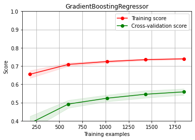
​    


## 4.7 lightgbm回归


```python
# lgb回归模型
clf = lgb.LGBMRegressor(
        learning_rate=0.01,
        max_depth=-1,
        n_estimators=100,
        boosting_type='gbdt',
        random_state=2019,
        objective='regression',
    )
clf.fit(
        X=train_data, y=train_target,
        eval_metric='MSE',
        verbose=50
    )

# 打印MSE
score = mean_squared_error(test_target, clf.predict(test_data))
print("lightGbm:   ", score)
```


```python
X = train_data.values
y = train_target.values
 
# LGBM
title = r"LGBMRegressor"
cv = ShuffleSplit(n_splits=10, test_size=0.2, random_state=0)

estimator = lgb.LGBMRegressor(
    learning_rate=0.01,
    max_depth=-1,
    n_estimators=100,
    boosting_type='gbdt',
    random_state=2019,
    objective='regression'
    )    #建模

plot_learning_curve(estimator, title, X, y, ylim=(0.4, 1.0), cv=cv, n_jobs=1)
```


​    
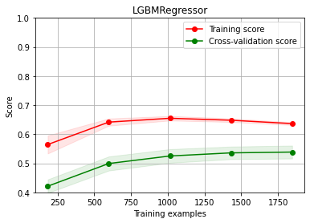
​    


# 5 模型对比
## 5.1 均方值误差MSE
在各种回归模型训练中，我均使用了*均方误差(MSE)* 来评估各个模型之间的性能。下面是我选择这个方法的原因：

统计目标数据和预测数据之间的差异本身就是一件很有意义的事，从直观上，如果预测数据与目标数据非常相像，那么证明我们的模型与实际的数据拟合的很好，这也体现在MSE越小，训练结果也就越好。
我们的出发点就是使得预测数据与实际数据相接近，而通过MSE这个数学上的性质和意义，MSE可以作为我们的训练方向，进而减少不必要的工作！
## 5.2 结果分析
可以看到，在模型上，我一共选择了

- KNN近邻回归
- 决策树回归
- 随机森林回归
- LightGBM回归
- 
方面起见，我在这里把他们的MSE数值按照以上顺序排列，分别是 $ P_1, P_2, P_3, P_4 $
对应的，$ P_1 = 0.26 $ , $ P_2 = 0.59 $, $P_3 = 0.24 $, $ P_4 = 0.73$,于是，整个结果就是 $$ MSE: P_3 < P_1 < P_2 < P_4 $$

所以，单从MSE上面进行比较，模型的准确度应该是

> 随机森林回归 > KNN近邻回归 > 决策树回归 > LightGBM回归

这些模型的训练周期全部都是10次，但是预测的准确度却大相径庭，尤其是LightGBM回归，这是为什么呢？在我查阅了相关资料后，有了一些自己的见解，我认为：

- 为什么随机随机森林回归的效果比较好？我觉得数据集特征如果非线性的成分比较多，那么随机森林会更好地拟合适应这些关系，相反，如果数据集的特征维度非常高或存在很多噪声，KNN和决策树可能表现不佳。所以在一开始的时候，我使用了PCA主成分分析法对数据进行降维。这个算法的主要步骤就是由原始数据可以得到协方差矩阵，进而可以得到整组数据的特征值和特征向量，进而把高维数据降维。同时，随机森林的准确度也取决于更多的树或更复杂的特征选择策略。这也就是为什么随机森林可以有较好的预测度。
为什么LightGBM效果这么差？在上述的参数选择中，可以看到n_estimators = 10，也就是说这里用到了10棵树，我猜测可能是这里的原因，因为树过少而导致模型的过于简单，于是我多增加了几棵树，然后再进行训练，最后MSE的值终于降到和决策树回归的准确率了
- 总的来说，为了减少训练时间和快速查看模型的状态，我这里并没有选择参数过大、比较复杂的模型，而是只选择了必要的参数。总的来说，这几个模型的预测准确率大概在80%。在使用更复杂的参数和模型并提高更好的硬件配置后，我相信模型的准确率会大大提高并且训练时间也会大大减少！
